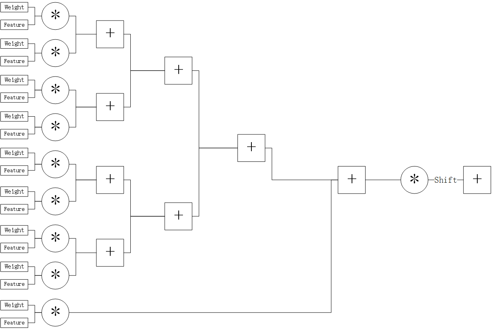
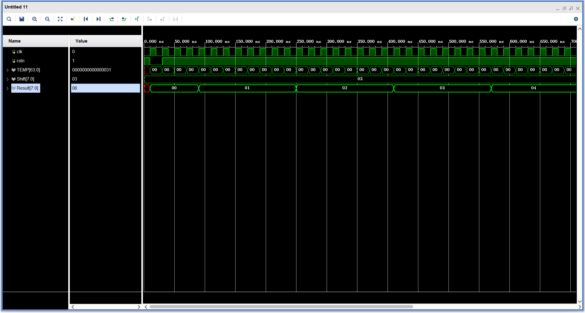
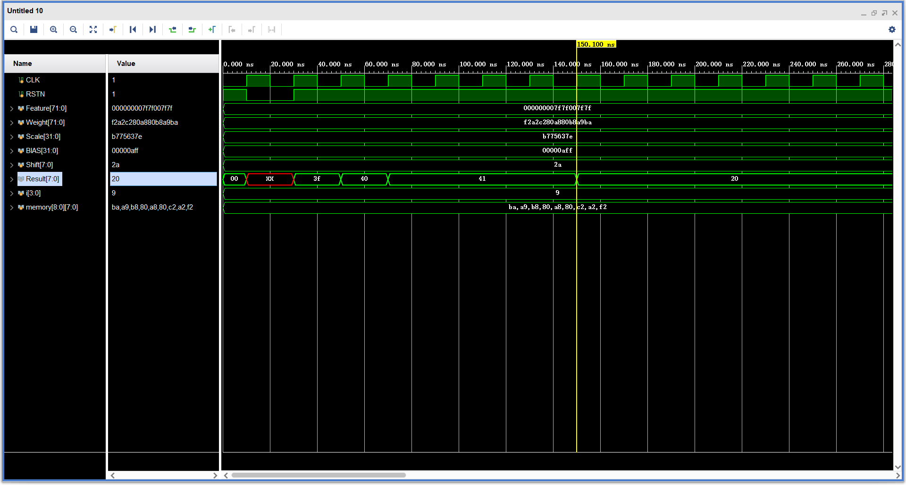

# 说明
本文件夹的代码是使用乘加树实现3*3卷积运算并达到加速的效果

# 量化运算公式
$Q_3^{(i, k)}$ = Z3 + ${S1S2\over S3}$$\sum_{j=1}^n$($Q_1^{(i, j)}$ - Z1)($Q_2^{(j, k)}$ - Z2)

# 代码思路
## 准备数据
* 卷积核权重

  这里如果和本项目采用的量化方法（PyTorch）一样的话，需要将数据转换成补码，因为卷积核的参数的数据类型是INT8，我这里使用的是IEEE 754标准将其转换成补码
* 卷积核偏移量

  这里如果和本项目采用的量化方法（PyTorch）一样的话，需要将数据转换成补码，因为卷积核的偏移量的数据类型是INT32，我这里使用的是IEEE 754标准将其转换成补码

* 缩放值、位移

  CNN量化后，会产生一个Float32数据类型的Scale，浮点计算会影响CNN的计算速度，所以我们这里利用近似计算的思想将其转换成缩放值和位移。

  设$M_0$ =${S1S2\over S3}$，如果$M_0$小于0.5的话，我们将其一直放大两倍直到$M_0$大于0.5，并记录放大的次数，然后将放大的次数加32，得到n值（n值即为要位移的值），将${S1S2\over S3}$乘$2^n$，M = $2^{-n}$$M_0$，然后将M的小数部分截断，这时候已经足够的保持精度了。在二进制中，乘2约等于左移一位，除2约等于右移一位，通过这样操作我们就可以将原来Float类型的Scale转换成INT64类型的Scale以及一个范围在[32, 64]的位移。

* 特征图

  这里如果和本项目采用的量化方法（PyTorch）一样的话，特征图直接转换成二进制即可，因为特征图在PyTorch中的量化是的数据类型UINT8

* 零点
  如果按照PyTorch官方文档进行计算层融合的话，这里所有的零点都为0，可以忽略

  ## 乘加树架构
  

  最后两列的乘法器和加法器针对INT8的推断设计的，如果零点都为0的话加法器可忽略。

  **注：这种架构可以覆盖CNN中绝大多数可以进行并行计算的计算类型，所以后续不再发布其他运算类型的实现的相关说明（部分计算核的实现代码会发布），之后会发布如何实现数据调度，Padding，计算核之间的调度等相关代码和说明。**
  
  通过这种架构6个时钟周期即可算出一次3*3点乘的结果（如果没有最后的加法器5个时钟周期即可），这里乘法器加法器我们均调用的是FPGA中DSP的资源，我个人倾向于优先使用DSP资源，这样做的好处是能够使运算部分能够跑较高的时钟（不经过特别的优化500MHz还是比较轻松的）。
  
  乘加树这一部分的代码就是调用IP核，唯一需要自己编写逻辑的就是移位这一块，如果直接进行移位的话，会发现FPGA计算的结果与PyTorch运行INT8的结果有微小的误差，而如果对缩放后的结果除$2^n$的话，结果会与PyTorch的推断结果丝毫不差，对于Yolo的Bouding Box来说，微小的误差会导致最后的结果不同，导致大大的影响了Yolo模型的精度，所以我们需要在移位这一块进行四舍五入。
  
  ## 四舍五入的实现
  假设除数为15，被除数为$2^3$，使用除法运算后并进行四舍五入的结果是2，而如果直接移位的话，就是对15的二进制向右移3位，也就是1111往右移3位得到结果1，这就是直接移位产生误差的原因。其实，我们只要进行二次移位，即可消除这种误差。
  
  1. 第一次移位的结果为1，此时我们需要算出余数，这里的余数我们使用异或门即可计算出来。即1111 ^ (1 << ( 3 + 1（移位结果） - 1))，得到111.
  2. 将余数进行移位，这里的移动的位数是原来移动的位数-1（即判断余数是否有除数的一半），得到的结果如果不为0，则金将第一次的移位结果加1，否则不移位，得到四舍五入后的结果。

  上述思路通过编写代码及仿真1个时钟周期即可完成。
  ## 移位仿真结果
  

  ## CNN仿真结果
  

# 下节内容
将乘加树变成多通道架构，并进行实际上板验证。更新时间应该会在四月底。

# 白皮书
Xilinx从UltraScale开始，对DSP的INT8进行了优化，可以同时算两组INT8在一片DSP资源上，感兴趣的可以了解下述白皮书，相关的实现和说明就不发布了。

[Embedded Vision with INT8 Optimization on Xilinx Devices](https://www.xilinx.com/support/documentation/white_papers/wp490-embedded-vision-int8.pdf)