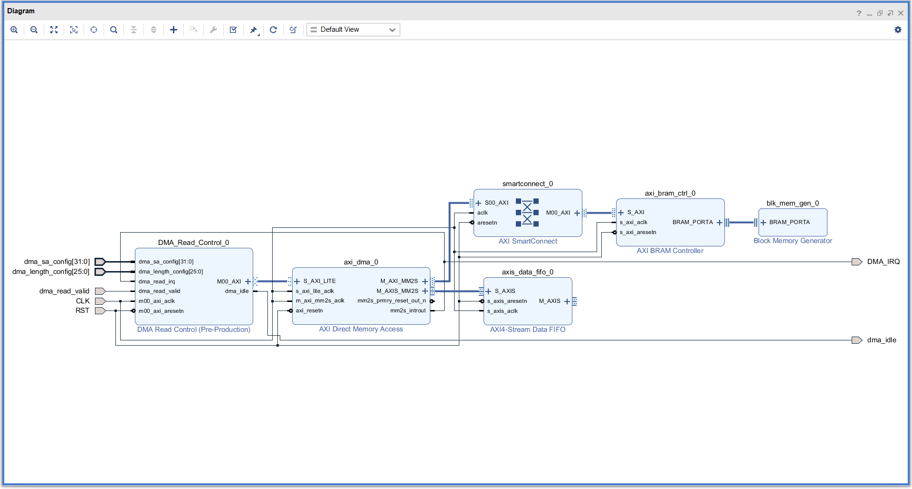
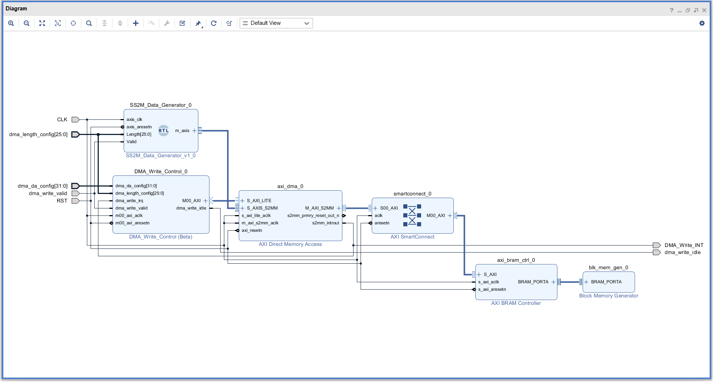
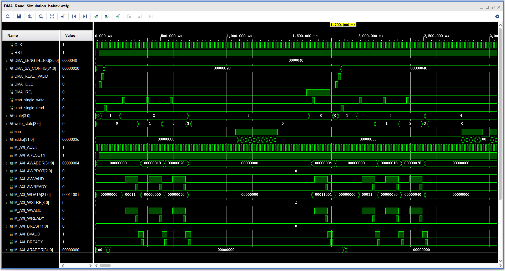
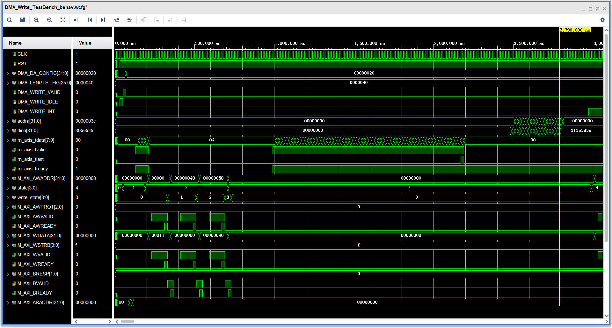

# 说明
本代码采用AXI DMA从DDR中读写数据来完成CPU/PS和FPGA/PL之间的数据交互，AXI DMA的一些简介说明请看Xilinx的官方文档PG021。

# 代码思路
这部分代码的思路和文档中的Programming Sequence一致。用状态机来控制AXI读取/写入的地址以及写入的内容。

从内存中读取数据，官方文档是这么说的：

A DMA operation for the MM2S channel is set up and started by the following sequence:
  1. Start the MM2S channel running by setting the run/stop bit to 1 (MM2S_DMACR.RS =
1). The halted bit (DMASR.Halted) should deassert indicating the MM2S channel is
running.
  2. If desired, enable interrupts by writing a 1 to MM2S_DMACR.IOC_IrqEn and
MM2S_DMACR.Err_IrqEn. The delay interrupt, delay count, and threshold count are not
used when the AXI DMA is configured for Direct Register Mode.
  3. Write a valid source address to the MM2S_SA register. If AXI DMA is configured for an
address space greater than 32, then program the MM2S_SA MSB register. If the AXI DMA
is not configured for Data Re-Alignment, then a valid address must be aligned or
undefined results occur. What is considered aligned or unaligned is based on the stream
data width. When AXI_DMA is configured in Micro Mode, it is your responsibility to
specify the correct address. Micro DMA does not take care of the 4K boundary.
For example, if Memory Map Data Width = 32, data is aligned if it is located at word
offsets (32-bit offset), that is 0x0, 0x4, 0x8, 0xC, and so forth. If DRE is enabled and
Streaming Data Width < 128, then the Source Addresses can be of any byte offset.
  4. Write the number of bytes to transfer in the MM2S_LENGTH register. A value of zero
written has no effect. A non-zero value causes the MM2S_LENGTH number of bytes to
be read on the MM2S AXI4 interface and transmitted out of the MM2S AXI4-Stream
interface. The MM2S_LENGTH register must be written last. All other MM2S registers
can be written in any order. In the case of Micro DMA, this value cannot exceed
[Burst_length * (Memory Mapped Data Width)/8].

从上述的说明我们可以知道，从内存中读取数据需要以下几个步骤：
  1. 检查DMA是否空闲
  2. 文档中的第二步可以忽略，这步的话主要是 是否启用 DMA读取完成中断 以及 错误终端，这里的话我们只启用DMA 读取完成中断。
  3. 往MM2S_SA寄存器（具体的寄存器地址请自行查询官方文档）写入源地址（也就是需要读取的数据的内存首地址），如果内存超过4GB的话需要往高位的MM2S_SA寄存器地址写入源地址，但是本代码没有这个需求，所以直接忽略这个高位寄存器（这里其实是不对的，奈何本人太懒了）。需要注意的是，这里牵扯到一个字节对齐的问题，如果DRE（Data Re-Alignment）没有设置（这部分是在DMA IP核初始配置的时候设置的），然后AXIS传输的位数大于128位的话，地址必须是4的倍数。
  4. 往MM2S_LENGTH寄存器（具体的寄存器地址请自行查询官方文档）写入要传输的数据位数；需要注意的是，这一步必须是最后一步执行，当我们往这里写入一个非0的数就会启动DMA的运行。

根据上述步骤，本代码在这块用了1个状态机以及1个计数器，具体实现请看代码。
  * 状态机
  
    用来控制AXI的工作状态

  * 计数器

    用来控制AXI的写地址，写内容

内存写入部分和读取大同小异，无非是要把寄存器地址更改一下，所以这里不再赘述，具体看官方文档的 A DMA operation for the S2MM channel is set up and started by the following sequence 部分

# 仿真部分
## 仿真流程

## 仿真设计
### DMA读取设计

### DMA写入设计

  注：SS2M_Data_Generator是自己编写的Verilog代码，用于生成数据测试DDR写入，详情请看代码。

如上图，用下列IP Core完成AXI DMA的仿真
* AXI Smart Connect，用来完成DMA与BRAM的互连
* AXI DMA
* AXI4-Stream Data FIFO， DMA的数据是以流形式进行的
* AXI BRAM Controller
* Block Ram Generator(BRAM Controller模式)

## 仿真结果
### DMA读取

### DMA写入

# 实际上板部分
本项目中数据交互需要和指令交互一同存在，所以本节不进行实际上板测试，只说一些简单的说明。

ZYNQ7 Processing System核的配置一般开发板的厂商都会提供，这里不提供说明。实际部分还需要在CPU/PL这部分编写C/C++代码完成数据交互，这里只提供ZYNQ的C++测试代码，需要注意的是这里没有使用Xilinx SDK，因为实际跑系统没有办法用到Xilinx SDK封装好的函数，这里提供的是PL端跑系统的代码，系统一般厂商也会提供移植好的，本项目后续也会编写移植系统这一块的教程。

实际往往会出现仿真没有出现的问题，所以我们这里需要加入ILA核进行调试，详见下节的指令交互部分。

# 参考文档
* [PG021 AXI DMA](https://www.xilinx.com/support/documentation/ip_documentation/axi_dma/v7_1/pg021_axi_dma.pdf)